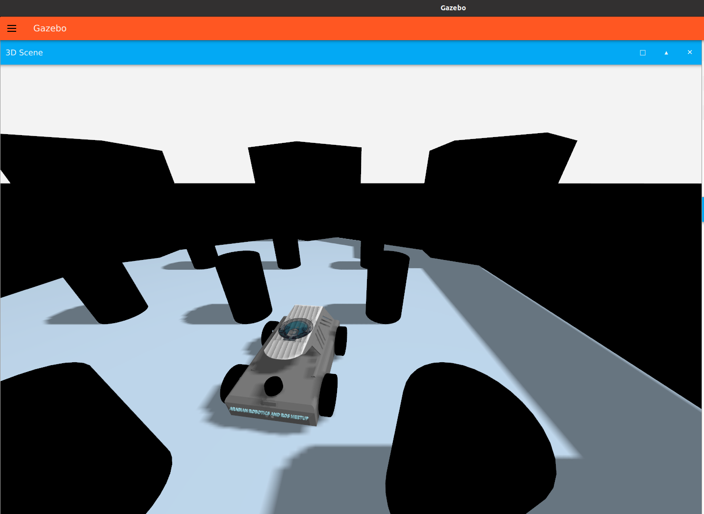
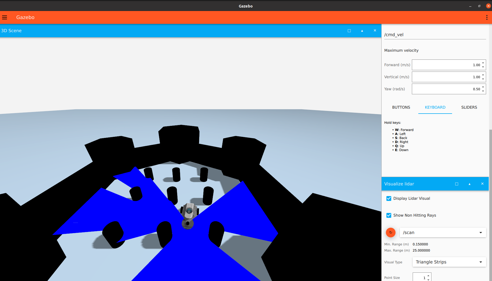
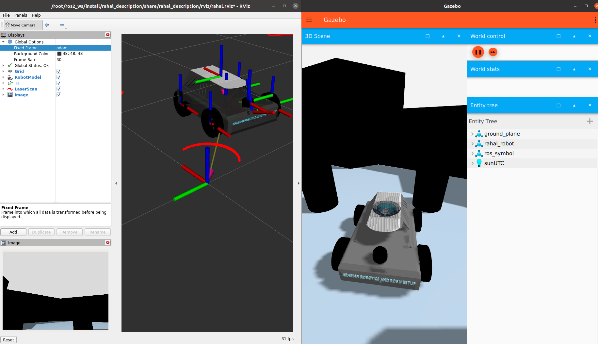
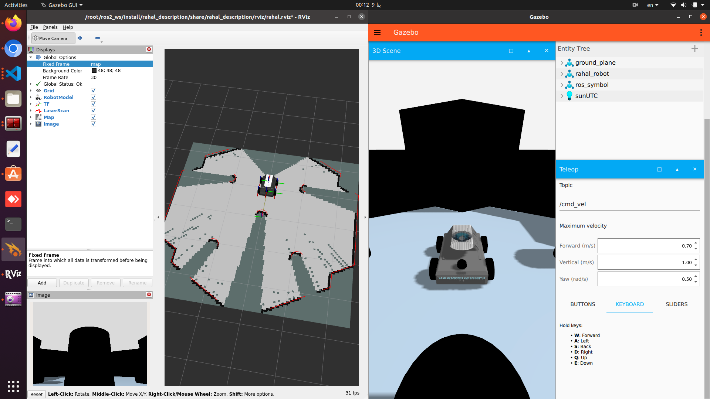

# Rahal Robot Repository

This repository contains the description and SLAM functionality for the Rahal Robot, leveraging **Gazebo Sim (Harmonic)** and  **ROS 2 Humble** . Follow the instructions to set up, simulate, and perform SLAM with the Rahal Robot.

The Rahal Robot is owned by the [Arab Robotics and ROS Meet](https://github.com/arab-meet) organization!



## Rahal Description

The `rahal_description` package provides the Simulation Description Format (SDF) models for the Rahal Robot. This package allows you to simulate the robot in Gazebo sim and integrate it with ROS 2.

### Setup Instructions:

#### 1. Export Simulation Resource Path

Ensure that Gazebo can locate the SDF files by exporting the `GZ_SIM_RESOURCE_PATH`. Replace `/your/path` with the actual path to your workspace's `src` directory:

```bash
export GZ_SIM_RESOURCE_PATH=$GZ_SIM_RESOURCE_PATH:/your/path/src
```

#### 2. Build the Workspace

Build your workspace to include the `rahal_description` package:

```bash
colcon build
```

#### 3. Source the Workspace

After building, source the setup script:

```bash
source install/setup.bash
```

### Now you ready to launch Rahal Robot's description

To launch the Rahal Robot's description in the simulation environment, use the following command:

```bash
ros2 launch rahal_description rahal_sim.launch.py
```

#### Visualizing LiDAR in Gazebo Sim



**Rviz**



---

## Rahal SLAM Toolbox

The `rahal_slam_toolbox` package leverages the **SLAM Toolbox** for online asynchronous SLAM, enabling the Rahal Robot to map and localize in real or simulated environments.

### Prerequisites

Install the following dependencies:

```bash
sudo apt install ros-humble-slam-toolbox
sudo apt install ros-humble-navigation2 ros-humble-nav2-bringup
```

### Launch SLAM Toolbox

To start SLAM in  **online asynchronous mode** , launch the SLAM Toolbox in other terminal

```bash
ros2 launch rahal_slam_toolbox slam_toolbox_online_async.py
```



### Move the Robot with TeleopTo move the robot, you have two options:

1. **Teleop in Gazebo Sim** :
   You can control the robot directly within **Gazebo Sim** using **Teleop** like i did.
2. **Teleop Twist Keyboard** :
   Alternatively, you can control the robot via the terminal with  **teleop_twist_keyboard** . To install it, run:

   ```bash
   sudo apt install ros-humble-teleop-twist-keyboard
   ```

   Run with

```bash
ros2 run teleop_twist_keyboard teleop_twist_keyboard
```


## Saving the Map

After completing SLAM, you can save the generated map for later use. Follow these steps:

### 1. Create a Directory for Maps

```bash
mkdir -p src/maps
```

### 2. Save the Map

Use the `map_saver_cli` tool from the `nav2_map_server` package to save the map. Replace `my_map` with your desired map name:

```
ros2 run nav2_map_server map_saver_cli -f src/maps/my_map
```

## Additional Notes

* **Dependencies:** Ensure that `slam_toolbox` and `navigation2` are properly installed and configured.
* **Robot Setup:** Verify that your robot's TF tree and sensor data (e.g., LiDAR) are correctly configured and published.
* **Testing:** Test your SLAM setup in a simulation environment or a controlled real-world space to ensure proper mapping.

---

## Contribution

Feel free to contribute to this repository! If you encounter any issues or have suggestions, open an issue or submit a pull request.
